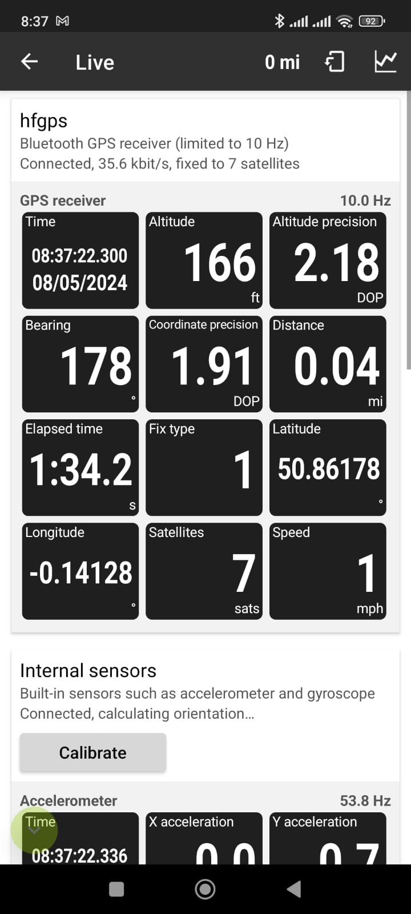

You may have never noticed it, but the GPS on most mobile phones is slow. It only updates at 1hz, the same speed since the first smart phones. Driving normally this isn't really an issue, but if you're on a track it becomes a problem. 80mph is about 37m/s, so with 37m between log points it becomes difficult to accurately log the path taken.

Racechrono supports external GPS receivers at 10hz over a bluetooth connection.

## Off the shelf options

QStarz GT [£200](http://racing.qstarz.com/Products/BL-1000GT.html)

## Making one

In theory we should only need a few bits:

- Bluetooth to Serial Port adapter
- 10hz GPS module with serial port
- USB to serial adapter to configure it all

Then configure the bluetooth module and GPS module to talk at the same baud rate, and configure the GPS module to output the data Racechrono expects.

Use [u-center](https://www.u-blox.com/en/product/u-center) to configure the GPS module. I turned my GPS module down to 10hz, and disabled Glonass, BeiDou and Galileo. The Racechrono developer is really helpful if you are having problems getting your module to work. As the GPS module just outputs a serial text stream, it's easy to get feedback on your output.

## The bits I used

[QUESCAN M10SD GPS receiver](https://www.aliexpress.com/item/1005005916443637.html)
[HC06 bluetooth module](https://www.aliexpress.com/item/1005002082974256.html)

## The result

It works.
