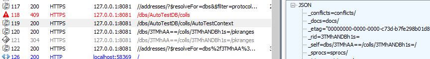

# Fiddler

Fiddler is a web debugger.  You can use it to intercept web requests made by the browser, capture the data sent, replay etc.  There are a number of other similar products such as PostMan, or Insomnia but the basic concept is the same.

When using the interceptor, a system wide proxy is set, and the browsers respect this causing the web requests to be sent via the Fiddler proxy where the data can be inspected, a cert can be installed to decrypt HTTPS

# The DotNet Issue

Fiddler works fine out of the box where we want to inspect requests made by the browser, but it will not allow us to inspect the web requests made by our DotNet service as it does not respect the system proxy setting.  We need to configure our application to respect the system proxy settings.

```csharp
IWebProxy proxy = WebRequest.GetSystemWebProxy();
proxy.Credentials = CredentialCache.DefaultCredentials;
HttpClient.DefaultProxy = proxy;
```

I put this into the constructor of my `Startup` class.  It works for me, I plan to remove the code once I'm done with debugging, but you could put a debug clause around it if you wanted to leave it there in production.


