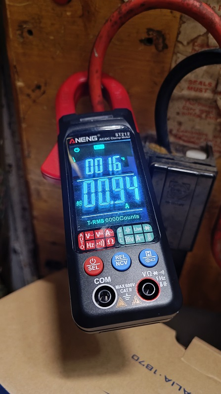

There are many companies offering to install solar panels. DIY should be an option, as it is [elsewhere](https://www.theguardian.com/environment/2024/dec/18/if-a-million-germans-have-them-there-must-be-something-in-it-how-balcony-solar-is-taking-off), but how does it work in the UK?

In short, UK legislation is in line with Europe, but with the caveat that you cannot export power via a 13a plug, it has to be done via a fused spur.
Normally the way this is done is an extra circuit is added, protected with an RCBO, then the inverted is connected to the fused spur.
[More info](https://www.renewsolar.co.uk/plug-in-solar-micro-solar/plug-in-solar-the-balcony-solar-system/)

## Legality in the UK

There are three types of solar installations in the UK:

- G99
  - High power installations, require authorisation from grid. Payments for export.
- G98
  - Medium power installations, require notification to the grid. Payments for export.
- Sub G98
  - Low power (0.8Kw), [no notification required](https://forums.overclockers.co.uk/threads/solar-panels-and-battery-any-real-world-reccomendations.18946524/page-394). No payments for exports, or [maybe we can](https://www.pluginsolar.co.uk/?p=9895) I will have a crack and update when I can.

## How much power can I generate?

If we install 800w of inverter, we could in theory generate 0.8Kw for 12 hours a day, that would be 9.8Kwh. That might be a bit optimistic in sunny Brighton, but I have read of real life users getting 3Kwh a day on an 800w system. You can overpanel to get you closer to the full number, I plan on running 900w of panels with my 800w inverter. The limitation to overpaneling is that the open circuit voltage of the panels combined must be less than the input voltage limit of the inverter. Imagine you have no load on the system, the voltage of the panels will rise until it reaches the open circuit voltage, the inverter needs to cope with this.

## How much power do I consume?

Due to the nature of the way power works, it can be hard to work out how much of our consumption can be covered by the inverter. The output power is limited, so consumption spikes will be served by the grid, but let's make the best measurements we can.

### Instantaneous measurement

A clamp meter is a great way to measure your consumption, but remember that it only shows the consumption at that instance. Here is my reading in the morning, before my wife woke up, devices are on in the house, but not doing much yet:

Roughly speaking, 0.95a at 245v is 233w.

### Averaged measurements

In January, I used 183.286kWh, this equates to an average of 246w over the course of the month (183.286/(31\*24)). Whilst I was away from my house with the desks switched off at the wall, I was using about 1.57kWh of electricity a day, or an average of 65w.

## Cost

The most basic installation requires:

- 800w of solar panels. [£60 \* 2](https://www.cityplumbing.co.uk/p/dmegc-solar-450wp-full-black-n-type-bifacial-pv-module-dm450m10rt-b54hbb-l/p/120106)
- 800w micro inverter. [£80](https://www.ebay.co.uk/itm/314669422202)
- Mounting hardware. [£30](https://www.aliexpress.com/item/1005007481536619.html)
- Minor wiring changes. £100

So all in about £350 to generate 800w. This compares to about £10,500 for a 7.5Kw system with a battery, or £4,100 for a comparable 800w system from [Octopus](https://octopus.energy/solar-installation-faq/#costs).

You could pay to have a pro install a larger system, and you may assume that it makes more money, but the electricity you consume is more valuable than the electricity you export. 1Kwh costs about £0.25 at current prices. The export price varies, but Octopus offer £0.15 at the moment. An export unit is only worth 60% of one that you would consume. So ideally you want to produce slightly less than your consumption, avoiding generating power the utility company isn't paying you for.
