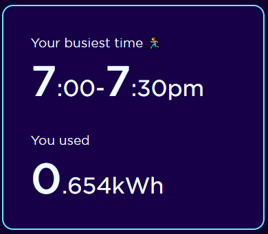

## Program Overview

My energy provider has a system where on particular days they offer refund for reducing energy below your average consumption. [Saving Sessions](https://octopus.energy/saving-sessions/)

## Basic Solution

I just accept the offer when it comes up, and half of the time I will use less electricity than my average. I can't really do much to decrease consumption as we use very little in the first place (200kwh/month with 2 people working from home), I could put off running the washing machine/dishwasher for an hour but it's unlikely to come up given I tend to run things in the morning.

## Sessions 2022-2023 Brighton

| Date     | DOW       | Start  | End     |
| -------- | --------- | ------ | ------- |
| 15/11/22 | Tuesday   | 5:00pm | 6:00pm  |
| 22/11/22 | Tuesday   | 5:30pm | 6:30pm  |
| 30/11/22 | Wednesday | 5:30pm | 6:30pm  |
| 01/12/22 | Thursday  | 5:00pm | 6:00pm  |
| 12/12/22 | Monday    | 5:00pm | 7:00pm  |
| 19/01/23 | Thursday  | 9:00am | 10:00am |
| 23/01/23 | Monday    | 5:00pm | 6:00pm  |
| 24/01/23 | Tuesday   | 4:30pm | 6:00pm  |
| 30/01/23 | Monday    | 9:00am | 10:00am |
| 13/02/23 | Monday    | 5:30pm | 6:30pm  |
| 21/02/23 | Tuesday   | 5:30pm | 6:30pm  |
| 15/03/23 | Wednesday | 6:30pm | 7:30pm  |
| 23/03/23 | Thursday  | 6:30pm | 7:30pm  |

I joined 11 of 13 sessions, received a discount of £4.12. Not bad for doing nothing, but I could do better.

## 2023-2024 Plan

11 of 13 last years events were early evening, 10 of them were on a Monday, Tuesday or Wednesday. Average consumption is calculated over the previous 10 days at the same time span. They will pay £2.25 per unused kwh, this compares to a usage price of about £0.28.

Electricity cost the same on my plan all hours of the day. I will shift my load into the hours likely to form part of a saving session, to increase average consumption, then reduce on the specified days. This will leave me with the same usage, but increase exposure to savings.

I will run energy heavy appliances at 5:30 when I need to run them, this will provide me the exposure I need.

I just need to bring my peak usage forward 1:30 and I am golden.

## Are Saving Sessions Dumb?

In a word: yes. They are supposed to reduce peak usage, but when looking at optimising, the best solution is to increase peak time usage in order that we can make savings when money is offered. This really doesn't serve the cause they are aiming for.

I am reminded of [snake breeding in India](https://en.wikipedia.org/wiki/Perverse_incentive#The_original_cobra_effect).
