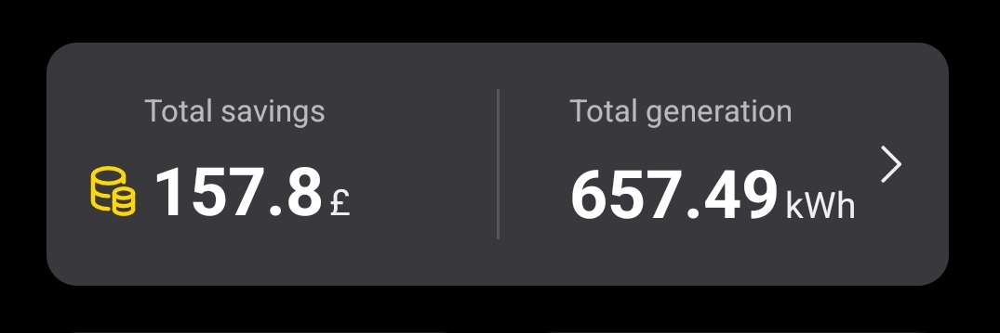
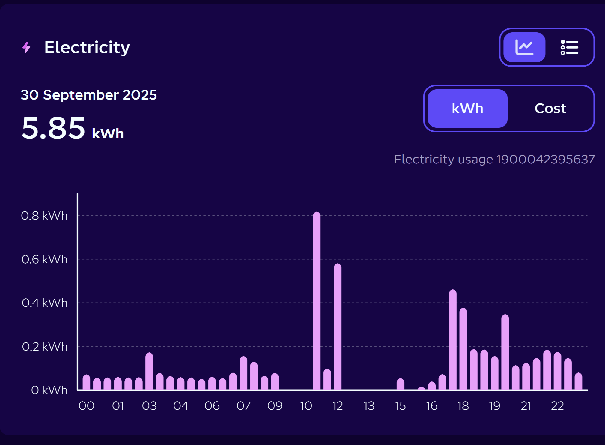
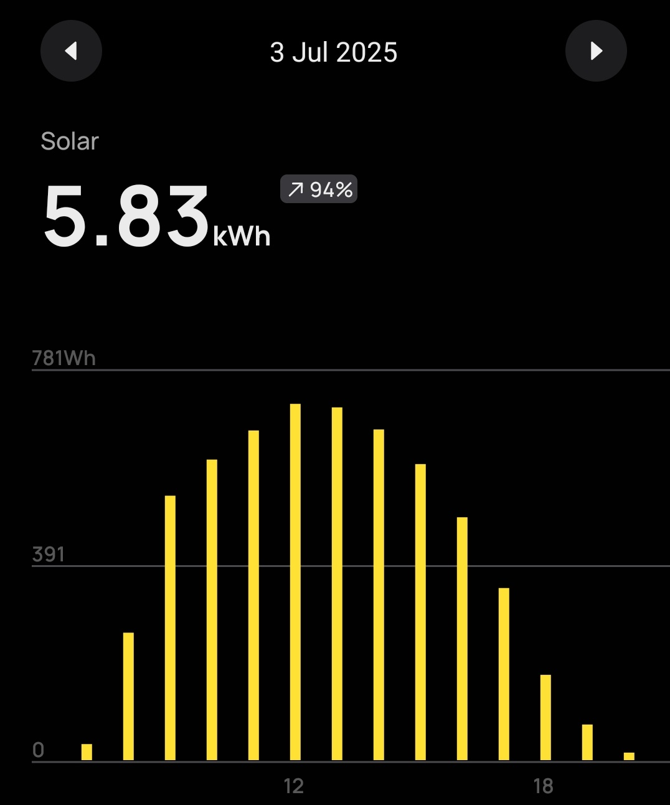
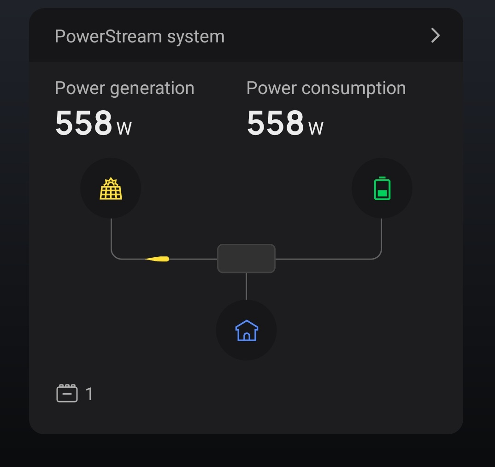
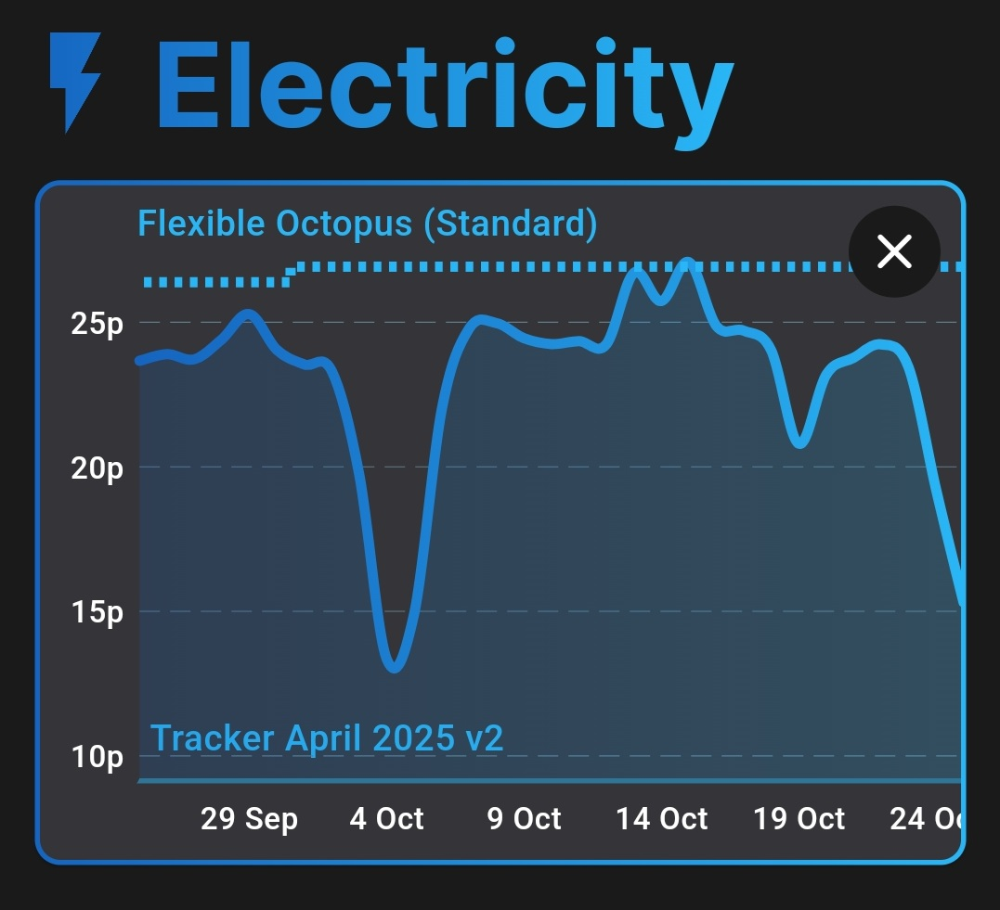
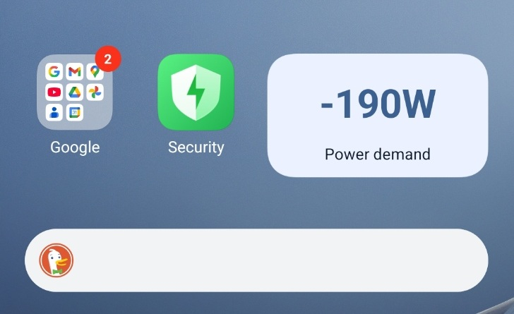

I have had my solar panels running since the end of March, about 7 months.

## App Stats

When I go away on holiday, I throttle the system down to 150w to keep the inverter cool and to avoid giving away too much power to the electricity company. Since the panels went up I have spent 5 weeks away, so the power reading should be higher again

## The reality

I don't have any way of measuring the amount of the power that I have used, but I observed my electricity bill drop by about £15 a month, so not huge. Having said that, getting half of the cost back in 7 months is good going. Over the winter, the system will make much less electricity, but I will be able to use 100% of it myself.

Notice how the power consumption drops to zero during daylight hours, except lunchtime when I have the kettle/microwave running.

I had some days over the summer where a lot of power was made (£1.46 worth). I didn't manage to consume all the power myself, but I could add a battery in the future.

Even in October there was some good power made on some days. On 24th October it made 2.56kwh, in the middle of the day, producing a 300w surplus over my home base load.

I use the Octopus Tracker energy tariff. This means the price I pay for electricity is set daily by the wind power available, so essentially if it's windy I have cheap electricity, but if it's sunny I need less power from the grid anyway.

I set up home assistant and the Octopus home mini to give me real time usage. I set up a widget on my phone so I can see when the system is running in surplus so I can add load.

## Next Stages

Whilst I am happy with my system, it doesn't really make enough power when it is overcast. I can fix this by adding more panels to my garage roof, but then I need a larger inverter to take more input. I am toying with the idea of getting a EcoFlow Stream X, or just adding a second small inverter with some panels attached.
